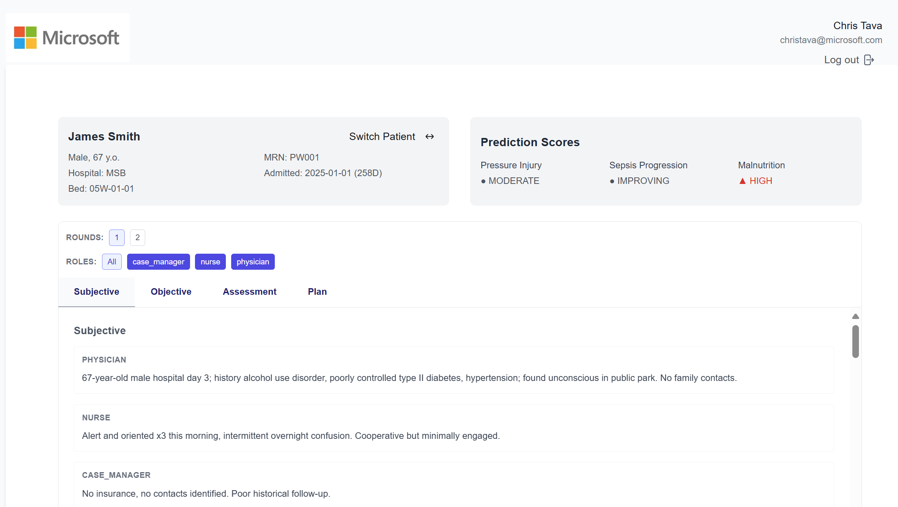

# Clinical Rounds App

The Clinical Rounds App is designed to streamline and enhance the efficiency of clinical rounds. Built with React, TypeScript, and Vite, this app provides a modern, fast, and reliable interface for healthcare professionals with Azure AD authentication and security group-based access control.



## Features

- Intuitive user interface for managing clinical rounds.
- Built with modern web technologies for optimal performance.
- **Azure AD Authentication** - Secure login using Microsoft identities
- Customizable and extendable to fit various clinical workflows.

## Getting Started

Follow the steps below to set up and run the application locally.

### Prerequisites

1. **Azure AD App Registration**: You need to register an application in Azure AD
2. **Node.js**: Ensure you have Node.js installed

### Azure AD Setup

1. Go to the Azure Portal and register a new application
2. Configure the redirect URI for your application (e.g., `http://localhost:5173`)
3. Note down the Client ID and Tenant ID
4. Configure API permissions:
   - **User.Read** - Read user profile information
   - **Directory.Read.All** - Read directory data (for security group validation)
5. **Create Security Groups** for access control:
   - Create an Azure AD security group for clinical staff
   - Create an Azure AD security group for administrators
   - Note down the Object IDs of these groups
6. **Configure Token Claims** (Optional but recommended):
   - In App Registration → Token configuration
   - Add optional claim "groups" to ID tokens and Access tokens

### Installation

To install the dependencies, run:

```bash
npm install
```

### Environment Configuration

1. Copy `.env.example` to `.env`:
```bash
cp .env.example .env
```

2. Update the `.env` file with your Azure AD configuration:
```bash
# REQUIRED - Azure AD Configuration
VITE_AZURE_CLIENT_ID=your-azure-ad-client-id
VITE_AZURE_AUTHORITY=https://login.microsoftonline.com/your-tenant-id
VITE_AZURE_REDIRECT_URI=http://localhost:5173

# REQUIRED - API Configuration
VITE_API_URL=http://localhost:8000

# REQUIRED - Security Group IDs for access control
VITE_CLINICAL_STAFF_GROUP_ID=your-clinical-staff-group-object-id
VITE_ADMIN_GROUP_ID=your-admin-group-object-id

# OPTIONAL - Domain hint for faster login
VITE_AZURE_DOMAIN_HINT=yourdomain.com
```

**Important**: Make sure all REQUIRED environment variables are set. The application will show an error if any are missing.

### Troubleshooting

#### AADSTS900144: The request body must contain the following parameter: 'client_id'

This error occurs when the Azure AD configuration is incomplete. Check:

1. **Environment Variables**: Ensure your `.env` file contains all required variables:
   - `VITE_AZURE_CLIENT_ID`
   - `VITE_AZURE_AUTHORITY`
   - `VITE_AZURE_REDIRECT_URI`

2. **Restart Development Server**: After adding environment variables, restart the dev server:
   ```bash
   npm run dev
   ```

3. **Verify Client ID**: Make sure the Client ID from Azure AD app registration is correctly copied

4. **Check Browser Console**: Look for configuration errors in the browser developer console

#### Other Common Issues

- **Unauthorized Access**: Ensure users are added to the configured security groups
- **Network Issues**: Check if the API URL is accessible
- **CORS Errors**: Ensure the backend API allows requests from your frontend domain

### Running the App

To start the development server, run:

```bash
npm run dev
```

This will start the app in development mode with hot module replacement (HMR) enabled.

## Authentication & Authorization

The application uses Azure AD (Microsoft Entra ID) for authentication with security group-based authorization:

### Authentication Flow
- Users must sign in with their Microsoft account
- The app uses MSAL (Microsoft Authentication Library) for React
- Authentication tokens are automatically included in API requests

### Authorization & Access Control
- **Security Groups**: Access is controlled using Azure AD security groups
- **Required Permissions**: Users must be members of authorized security groups
- **API Permissions**: The application requires:
  - `User.Read` - To read user profile information
  - `Directory.Read.All` - To validate security group membership
- **Group Validation**: User group membership is validated on login and during API calls

### Setting Up Security Groups
1. **Create Security Groups** in Azure AD:
   ```
   - Clinical Staff Group (for healthcare professionals)
   - Admin Group (for system administrators)
   ```
2. **Add Users** to appropriate security groups
3. **Configure Environment Variables** with group Object IDs
4. **Grant Admin Consent** for Directory.Read.All permission

### Access Control Features
- Automatic validation of user group membership
- Graceful handling of unauthorized users
- Session management with group-based permissions

## Docker

You can also run this application using Docker.

### Building the Docker Image

To build the Docker image, run:

```bash
docker build -t clinical-rounds-fe .
```

### Running the Docker Container

To run the container from the built image:

```bash
docker run -p 8080:80 \
  -e VITE_AZURE_CLIENT_ID=your-client-id \
  -e VITE_AZURE_AUTHORITY=https://login.microsoftonline.com/your-tenant-id \
  -e API_URL=https://api.example.com \
  clinical-rounds-fe
```

This will start the application and make it available at http://localhost:8080

### Environment Variables

The application supports the following environment variables:

- `VITE_AZURE_CLIENT_ID`: Azure AD application client ID
- `VITE_AZURE_AUTHORITY`: Azure AD authority URL
- `VITE_AZURE_REDIRECT_URI`: Redirect URI for authentication
- `VITE_API_URL`: Backend API URL
- `VITE_CLINICAL_STAFF_GROUP_ID`: Object ID of the clinical staff security group
- `VITE_ADMIN_GROUP_ID`: Object ID of the administrator security group

## Security

- All API requests include authentication tokens when available
- Users must authenticate before accessing the application
- **Security group membership validation** ensures only authorized users can access the app
- Session information is stored securely using MSAL's session management
- Group membership is validated using Microsoft Graph API

## Expanding the ESLint Configuration

If you are developing a production application, we recommend updating the configuration to enable type-aware lint rules:

- Configure the top-level `parserOptions` property like this:

```js
export default {
  // ...existing code...
  parserOptions: {
    ecmaVersion: 'latest',
    sourceType: 'module',
    project: ['./tsconfig.json', './tsconfig.node.json'],
    tsconfigRootDir: __dirname,
  },
}
```

- Replace `plugin:@typescript-eslint/recommended` with `plugin:@typescript-eslint/recommended-type-checked` or `plugin:@typescript-eslint/strict-type-checked`.
- Optionally add `plugin:@typescript-eslint/stylistic-type-checked`.
- Install [eslint-plugin-react](https://github.com/jsx-eslint/eslint-plugin-react) and add `plugin:react/recommended` & `plugin:react/jsx-runtime` to the `extends` list.

## Official Plugins

Currently, two official plugins are available:

- [@vitejs/plugin-react](https://github.com/vitejs/vite-plugin-react/blob/main/packages/plugin-react/README.md) uses [Babel](https://babeljs.io/) for Fast Refresh.
- [@vitejs/plugin-react-swc](https://github.com/vitejs/vite-plugin-react-swc) uses [SWC](https://swc.rs/) for Fast Refresh.
